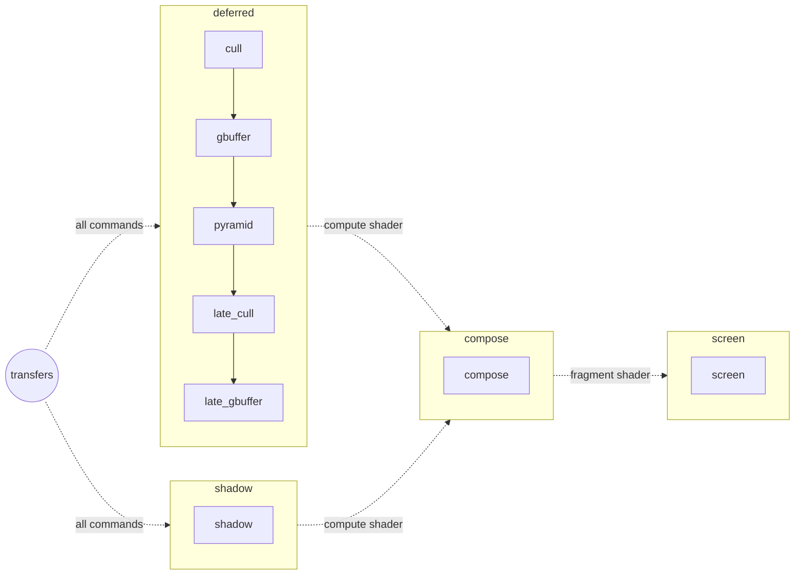

# The render graph

The passes of a frame are not chained by hand. Each one is declared with the resources it reads and writes, and the
render graph of the window (`VulkanPipeline`) derives:

- the order the passes are recorded in, and the order their subpasses are submitted in;
- the barriers between the passes recorded in the same command buffer: stages, accesses and layout transitions;
- the semaphores between the subpasses, each awaited at the stages that read what the other one wrote;
- the memory of the images the graph owns, shared by the images no pass uses at the same time.

The graph is a scheduling layer: `VulkanSubpass`, `DrawSubpass` and `ComputeSubpass` stay the execution layer, each
recording its passes in its command buffer and submitting it.

## Subpasses and passes

A **subpass** is a command buffer submitted once per frame (a render target of its own for a `DrawSubpass`). A
**pass** is something recorded in a subpass, a raster pass drawing in its render pass or a compute pass dispatching
outside of it. A subpass holds several passes: the deferred subpass of a scene records its cull pass, its g-buffer, its
depth pyramid, its late cull pass and its late g-buffer.

```
let dmut pipeline = window:.getVulkanPipeline ();
pipeline:.registerSubPass ("deferred", alias subpass);

pipeline:.declarePass (GraphPass (name-> "cull",
                                  submission-> "deferred",
                                  kind-> PassKind::COMPUTE,
                                  uses-> copy [ResourceUse (resource-> "draws", usage-> Usage::STORAGE_WRITE)],
                                  recording-> (&self:.recordCull)?));

pipeline:.declarePass (GraphPass (name-> "gbuffer",
                                  submission-> "deferred",
                                  uses-> copy [ResourceUse (resource-> "draws", usage-> Usage::INDIRECT),
                                               ResourceUse (resource-> "albedo", usage-> Usage::COLOR_ATTACHMENT),
                                               ResourceUse (resource-> "depth", usage-> Usage::DEPTH_ATTACHMENT)],
                                  recording-> (&self:.recordGbuffer)?));
```

- `recording` is called while the subpass is recorded, after the barrier of the pass; `getCurrentFrame` and
  `getDrawingCommandBuffer` of the subpass give the frame and the command buffer. A pass without a recording emits the
  `onDraw` signal of its subpass (the pass of the screen, drawing the widgets).
- A `DrawSubpass` begins its render pass for its first raster pass, clearing the attachments, ends it before a compute
  pass or a barrier, and begins it again for the next raster pass, loading them. Its `onPrepare` signal is emitted
  before any pass, to lay out what the passes draw.
- The pass of the screen, `SCREEN`, is declared by the pipeline and recorded last; `readOnScreen (name)` makes it read
  an image a widget shows (the output of a scene).

## Resources

| Declaration | Owner | Barriers |
|---|---|---|
| `importImage (name, texture)` | the declarer, one image per frame in flight | memory barriers and layout transitions |
| `importBuffer (name)` | the declarer | memory barriers, the buffer itself is not needed: a name can stand for the buffers of several batches |
| `createImage (name, ImageDesc (...))` | the graph, for one frame | memory barriers and layout transitions, starting from `undefined` each frame |

The graph allocates a transient image while an enabled pass uses it. `getTexture (name)` returns its texture for the
frames recorded from now on; a pass binds it when it is recorded, its texture changing when the memory is shared
differently. The framebuffers of a `DrawSubpass::toImages` are created by the graph once its attachments are
allocated, in the order of the attachments of its first raster pass.

### Usages

| Usage | Pass | Stages | Layout of a color / depth image |
|---|---|---|---|
| `COLOR_ATTACHMENT` | raster | color attachment output | shader read only, left by the render pass |
| `DEPTH_ATTACHMENT` | raster | early and late fragment tests | depth read only, left by the render pass |
| `SAMPLED_FRAGMENT` | raster | fragment shader | shader read only / depth read only |
| `SAMPLED_COMPUTE` | compute | compute shader | shader read only / depth read only |
| `STORAGE_READ`, `STORAGE_WRITE`, `STORAGE_READ_WRITE` | compute | compute shader | general |
| `INDIRECT` | raster | draw indirect | buffers only |
| `VERTEX_READ` | raster | vertex shader | buffers only |

A pass may use a resource several ways (`INDIRECT` and `VERTEX_READ` of the same commands), in the same layout. A
`STORAGE_WRITE` overwrites the image, which is transitioned from `undefined`.

## Order

A resource written by several passes is written in the order the passes are declared, and a pass reads what the last
of them declared before it wrote; the pass of the screen comes last. So a read depends on the last write before it,
and a write on the last write and the reads since. `declarePass (pass, before-> name)` declares a pass before another
one: the shadow map of a scene, declared when a light starts casting shadows, is declared before the composition that
reads it.

The passes of a subpass are recorded in the order of their declaration, and the subpasses submitted in the order of
their dependencies: a subpass comes before the subpasses reading what it writes, and the subpasses nothing orders keep
the order of their first pass. Two subpasses depending on each other are refused.

Between two subpasses, the graph creates a semaphore per frame in flight, awaited at the stages of the reads. The
subpasses depending on no other one wait for the transfers of the frame at every stage, and the screen waits for the
subpasses nothing reads, so awaiting the screen awaits the whole frame.

## Conditional passes

- `enablePass (name, false)` disables a pass: it is not recorded, its uses do not exist, and a subpass left without
  passes is not submitted. A scene enables its cull pass with the culling on the GPU, and its depth pyramid and late
  passes with the occlusion culling.
- `ResourceUse (..., optional-> true)` is dropped when no pass wrote the resource before it in the frame, or when the
  resource is not declared: the composition reads the shadow map only while a light casts shadows.
- `removeSubPass (name)` removes a subpass and its passes; the subpass is still used by the frames in flight and is
  retired.

A change is compiled at the next frame, every subpass being recorded again. A declaration made of several changes is
made between `Window::lockFrame` and `unlockFrame`, so no frame compiles it half done (see `Scene::configure`).

## Exporting the graph

`VulkanPipeline::exportGraph ()` returns the graph compiled last as a configuration, to dump in json: the subpasses in
the order of their submission, the passes (the disabled ones too) with their uses and the barriers recorded before them,
the semaphores between the subpasses, and the resources with their lifetime and their memory. The demo writes it with
`./demo --graph graph.json`, `X` writing it again (after `H`, `G` or `O` changed the passes), and `tools/passgraph`
draws it with graphviz, the resources as nodes with `-r`:

```
cd tools && gyllir build
./passgraph ../graph.json | dot -Tpng -o graph.png
```

## The graph of a scene

With shadows, the culling on the GPU and the occlusion culling (`./demo --shadows --gpu-cull --occlusion`):



| Resource | Owner | Written by | Read by |
|---|---|---|---|
| `draws`, `late_draws` | imported buffers | the cull passes | the g-buffers (indirect, vertices) |
| `cull_state` | imported buffers | both cull passes | both cull passes |
| `hzb` | imported buffer (the depth pyramid) | the pyramid | the late cull pass |
| `gbuffer_*` (6 images: normals, base colour and occlusion, materials, metalness and roughness, emissive colour, depth) | transient | both g-buffers | the pyramid (depth), the composition (positions rebuilt from the depth, the texels of the maps multiplying the factors of the materials) |
| `shadow_atlas` | transient | the shadow map | the composition (optional) |
| `output` | imported image | the composition | the screen |
