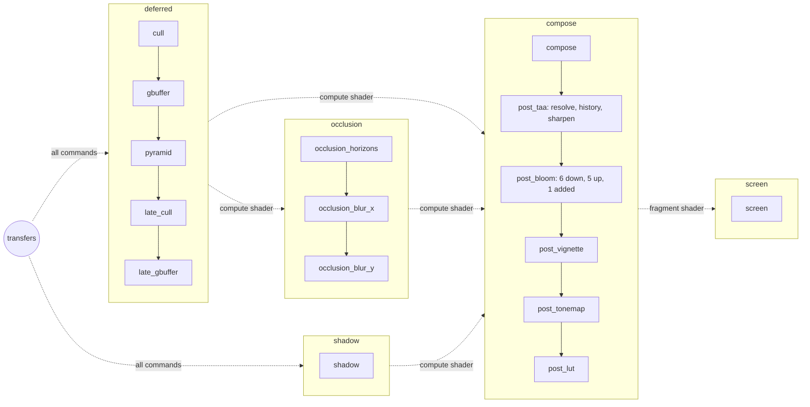

# The render graph

The passes of a frame are not chained by hand. Each one is declared with the resources it reads and writes, and the
render graph of the window (`VulkanPipeline`) derives:

- the order the passes are recorded in, and the order their subpasses are submitted in;
- the barriers between the passes recorded in the same command buffer: stages, accesses and layout transitions;
- the semaphores between the subpasses, each awaited at the stages that read what the other one wrote;
- the memory of the images the graph owns, shared by the images no pass uses at the same time.

The graph is a scheduling layer: `VulkanSubpass`, `DrawSubpass` and `ComputeSubpass` stay the execution layer, each
recording its passes in its command buffer and submitting it.

## Subpasses and passes

A **subpass** is a command buffer submitted once per frame (a render target of its own for a `DrawSubpass`). A
**pass** is something recorded in a subpass, a raster pass drawing in its render pass or a compute pass dispatching
outside of it. A subpass holds several passes: the deferred subpass of a scene records its cull pass, its g-buffer, its
depth pyramid, its late cull pass and its late g-buffer, and its compose subpass its composition and the passes of its
post-process chain.

```
let dmut pipeline = window:.getVulkanPipeline ();
pipeline:.registerSubPass ("deferred", alias subpass);

pipeline:.declarePass (GraphPass (name-> "cull",
                                  submission-> "deferred",
                                  kind-> PassKind::COMPUTE,
                                  uses-> copy [ResourceUse (resource-> "draws", usage-> Usage::STORAGE_WRITE)],
                                  recording-> (&self:.recordCull)?));

pipeline:.declarePass (GraphPass (name-> "gbuffer",
                                  submission-> "deferred",
                                  uses-> copy [ResourceUse (resource-> "draws", usage-> Usage::INDIRECT),
                                               ResourceUse (resource-> "albedo", usage-> Usage::COLOR_ATTACHMENT),
                                               ResourceUse (resource-> "depth", usage-> Usage::DEPTH_ATTACHMENT)],
                                  recording-> (&self:.recordGbuffer)?));
```

- `recording` is called while the subpass is recorded, after the barrier of the pass; `getCurrentFrame` and
  `getDrawingCommandBuffer` of the subpass give the frame and the command buffer. A pass without a recording emits the
  `onDraw` signal of its subpass (the pass of the screen, drawing the widgets).
- A `DrawSubpass` begins its render pass for its first raster pass, clearing the attachments, ends it before a compute
  pass or a barrier, and begins it again for the next raster pass, loading them. Its `onPrepare` signal is emitted
  before any pass, to lay out what the passes draw.
- The pass of the screen, `SCREEN`, is declared by the pipeline and recorded last; `readOnScreen (name)` makes it read
  an image a widget shows (the output of a scene).

## Resources

| Declaration | Owner | Barriers |
|---|---|---|
| `importImage (name, texture)` | the declarer, one image per frame in flight | memory barriers and layout transitions |
| `importBuffer (name)` | the declarer | memory barriers, the buffer itself is not needed: a name can stand for the buffers of several batches |
| `createImage (name, ImageDesc (...))` | the graph, for one frame | memory barriers and layout transitions, starting from `undefined` each frame |
| `createImage (name, ImageDesc (persistent-> true, ...))` | the graph, one image for every frame (a history) | memory barriers and layout transitions, starting each frame in the layout the frame before left it |

The graph allocates a transient image while an enabled pass uses it. `getTexture (name)` returns its texture for the
frames recorded from now on; a pass binds it when it is recorded, its texture changing when the memory is shared
differently. The framebuffers of a `DrawSubpass::toImages` are created by the graph once its attachments are
allocated, in the order of the attachments of its first raster pass.

A persistent image keeps its content from a frame to the next: one image (`OutputTexture::shared`) every frame slot
reads and writes, never sharing its memory, allocated again when its description changes, its content undefined until
a pass writes it. Its first use in a frame waits for its last use in the frame before, which the frames submit in the
same queue: the passes using it are in one subpass, `compile` refusing a graph where two subpasses use it. `--graph`
draws it bold.

### Usages

| Usage | Pass | Stages | Layout of a color / depth image |
|---|---|---|---|
| `COLOR_ATTACHMENT` | raster | color attachment output | shader read only, left by the render pass |
| `DEPTH_ATTACHMENT` | raster | early and late fragment tests | depth read only, left by the render pass |
| `SAMPLED_FRAGMENT` | raster | fragment shader | shader read only / depth read only |
| `SAMPLED_COMPUTE` | compute | compute shader | shader read only / depth read only |
| `STORAGE_READ`, `STORAGE_WRITE`, `STORAGE_READ_WRITE` | compute | compute shader | general |
| `INDIRECT` | raster | draw indirect | buffers only |
| `VERTEX_READ` | raster | vertex shader | buffers only |

A pass may use a resource several ways (`INDIRECT` and `VERTEX_READ` of the same commands), in the same layout. A
`STORAGE_WRITE` overwrites the image, which is transitioned from `undefined`.

## Order

A resource written by several passes is written in the order the passes are declared, and a pass reads what the last
of them declared before it wrote; the pass of the screen comes last. So a read depends on the last write before it,
and a write on the last write and the reads since. `declarePass (pass, before-> name)` declares a pass before another
one: the shadow map of a scene, declared when a light starts casting shadows, is declared before the composition that
reads it.

The passes of a subpass are recorded in the order of their declaration, and the subpasses submitted in the order of
their dependencies: a subpass comes before the subpasses reading what it writes, and the subpasses nothing orders keep
the order of their first pass. Two subpasses depending on each other are refused.

Between two subpasses, the graph creates a semaphore per frame in flight, awaited at the stages of the reads. The
subpasses depending on no other one wait for the transfers of the frame at every stage, and the screen waits for the
subpasses nothing reads, so awaiting the screen awaits the whole frame.

## Conditional passes

- `enablePass (name, false)` disables a pass: it is not recorded, its uses do not exist, and a subpass left without
  passes is not submitted. A scene enables its cull pass with the culling on the GPU, and its depth pyramid and late
  passes with the occlusion culling.
- `ResourceUse (..., optional-> true)` is dropped when no pass wrote the resource before it in the frame, or when the
  resource is not declared: the composition reads the shadow map only while a light casts shadows.
- `removeSubPass (name)` removes a subpass and its passes; the subpass is still used by the frames in flight and is
  retired.

A change is compiled at the next frame, every subpass being recorded again. A declaration made of several changes is
made between `Window::lockFrame` and `unlockFrame`, so no frame compiles it half done (see `Scene::configure`).

## Exporting the graph

`VulkanPipeline::exportGraph ()` returns the graph compiled last as a configuration, to dump in json: the subpasses in
the order of their submission, the passes (the disabled ones too) with their uses and the barriers recorded before them,
the semaphores between the subpasses, and the resources with their lifetime and their memory. The demo writes it with
`./demo --graph graph.json`, `X` writing it again (after `H`, `G` or `O` changed the passes), and `tools/passgraph`
draws it with graphviz, the resources as nodes with `-r`:

```
cd tools && gyllir build
./passgraph ../graph.json | dot -Tpng -o graph.png
```

## The graph of a scene

With shadows, the culling on the GPU, the occlusion culling and the ambient occlusion (`./demo --shadows --gpu-cull
--occlusion --ambient-occlusion`):



| Resource | Owner | Written by | Read by |
|---|---|---|---|
| `draws`, `late_draws` | imported buffers | the cull passes | the g-buffers (indirect, vertices) |
| `cull_state` | imported buffers | both cull passes | both cull passes |
| `hzb` | imported buffer (the depth pyramid) | the pyramid | the late cull pass |
| `gbuffer_*` (7 images: normals, base colour and occlusion, materials, metalness and roughness, emissive colour, velocity, depth) | transient | both g-buffers | the pyramid (depth), the ambient occlusion (depth and normals), the composition (positions rebuilt from the depth, the texels of the maps multiplying the factors of the materials, all but the velocity), the post effects reading them (the anti-aliasing: depth and velocity) |
| `shadow_atlas` | transient | the shadow map | the composition (optional) |
| `occlusion_noisy`, `occlusion_rows`, `occlusion_out` | transient (`R8_UNORM`, storage, `occlusionScale` times the size of the g-buffer) | the horizons of the ambient occlusion, its blur along the rows, its blur along the columns | the blur along the rows, the blur along the columns, the composition (optional) |
| `radiance` | transient (`R16G16B16A16_SFLOAT`, storage) | the composition (the light the camera sees, linear and unbounded) | the first pass of the post-process chain |
| `post_<effect>_out` | transient (`R16G16B16A16_SFLOAT` before the tone mapping, `R8G8B8A8_UNORM` after it, storage) | the last pass of an effect of the post-process chain, but the last effect | the first pass of the next effect |
| `post_taa_resolved` | transient (`R16G16B16A16_SFLOAT`, storage) | the resolve of the anti-aliasing (the frame blended with the history) | the copy into the history, the sharpening |
| `post_taa_history` | persistent (`R16G16B16A16_SFLOAT`, storage) | the copy of the blend | the resolve of the next frame |
| `post_bloom_mip<k>`, `post_bloom_up<k>` | transient (`R16G16B16A16_SFLOAT`, storage, 2^k times smaller) | the downsampling and the upsampling passes of the bloom | the next pass of the bloom |
| `output` | imported image (`R8G8B8A8_UNORM` written, sampled through an `R8G8B8A8_SRGB` view) | the last pass of the post-process chain, the tone mapping without effects in display space | the screen |

## The ambient occlusion

The ambient light of a scene stands in for the light reaching each point from all around, which the creases, the
corners and the feet of the objects receive less of. The screen-space ambient occlusion (`AmbientOcclusion`, enabled by
`Scene::ambientOcclusion`, off by default) computes the share of it reaching each pixel from what the g-buffer holds, in
a compute subpass of its own between the g-buffer and the composition, the GPU time of its subpass measured with the
others (`VulkanPipeline` debug logs):

- `occlusion_horizons` (the ground truth ambient occlusion of Jimenez, 2016): around each pixel, along
  `occlusionSamples` directions of the screen (4), the highest horizon on each side is searched among the points the
  depth holds within `occlusionRadius` (0.5 world units, at most a fifth of the height of the image), 4 steps on each
  side, and the visible arc between the two horizons integrated against the cosine of the normal, raised to the power
  `occlusionIntensity` (1.5); the directions and the steps are rotated by an interleaved gradient noise of the pixel;
- `occlusion_blur_x` and `occlusion_blur_y`: a separable bilateral blur of 9 texels removes the noise, the texels
  away from the tangent plane of each pixel left out, so the occlusion of a surface does not bleed over its edges.

The images are `occlusionScale` times the size of the g-buffer (from 0.25 to 1, 1 by default, `--occlusion-scale` in
the demo): smaller, each texel of the occlusion is computed and blurred at the texel of the g-buffer at its center, and
the composition upsamples it from the four texels around each pixel, weighed by their bilinear weights and by how close
their depth is to the depth of the pixel, so the occlusion does not bleed over the edges; its cost falls with the
square of the scale.

The composition multiplies the ambient light alone by it, and by the occlusion baked in the maps of the materials: the
lights are direct, not occluded. The images are `R8_UNORM` storage images, which needs the
`shaderStorageImageExtendedFormats` feature of the device (`VulkanDevice::isExtendedStorage`), the occlusion staying
disabled without it. Disabled, its passes are left out of the graph, its subpass is not submitted and the composition
does not read it (an optional use). At 1280 × 720 on an Intel Lunar Lake iGPU, the subpass takes about 1.2 ms.

## The lighting of the environment

The light of the environment (`EnvironmentLighting`, set by `Scene::setEnvironment` from an equirectangular Radiance
`.hdr` image, `--environment` in the demo, `E` cycling through `res/environments`) is the indirect light of the
composition in place of the ambient colour of the scene. It declares nothing in the graph: it is precomputed once when
the environment changes, recorded in the transfer pass of the device, which runs before the subpasses of the frame that
first samples it, and the frames only sample what it computed. Its images are owned by the lighting, bound to the
composition like the shadow cascades, and retired with the frames using them when the environment changes:

| Image | Format | Computed by |
|---|---|---|
| environment cube | `R16G16B16A16_SFLOAT`, twice a quarter of the width of the image (64 to 1024), all its levels | `environment_cube` projects the equirectangular image, its RGBE texels copied as they are and decoded by the shader, on the first level; `environment_downsample` averages each level from the one before it |
| irradiance | `R16G16B16A16_SFLOAT`, 32² | `environment_irradiance`: the environment convolved by the cosine around each direction, divided by π (the diffuse light) |
| prefiltered | `R16G16B16A16_SFLOAT`, 128², 6 levels | `environment_prefilter`: each level the environment reflected by a surface of a roughness from 0 to 1, 512 GGX samples reading the environment at the level of their solid angle (the specular light) |
| BRDF table | `R16G16_SFLOAT`, 256² | `environment_brdf`, once when the scene is configured: the scale and the bias of the reflectance facing the eye, by the cosine to the eye and the roughness (the split sum of Karis) |

The composition lights each pixel by the irradiance around its normal times its diffuse colour, and by the prefiltered
level of its roughness along the reflection of the eye times the reflectance of the table, the diffuse light being what
the specular reflection leaves; the occlusions shade the diffuse light, and the specular light through the specular
occlusion of Lagarde. Where nothing is drawn, the environment cube is the background (`Scene::skybox`, on by default);
`Scene::environmentIntensity` scales it all. The table is an extended storage format, so the scenes of the devices
without `shaderStorageImageExtendedFormats` keep their ambient colour.

## The post-process chain

The passes between the composition and the screen are the `PostChain` of the scene (`Scene::getPostChain`), an ordered
list of `PostEffect`s: fullscreen compute passes, each effect reading the image the effect before it wrote and writing
its own. An effect declares the space of the colours it works on, `HDR` (the light, before the tone mapping) or
`DISPLAY` (the colours of the screen, encoded in sRGB, after it), the images of the g-buffer it reads besides (`DEPTH`,
`NORMALS`, `VELOCITY`), its compute shaders and the size of its parameters. The tone mapping is the effect the chain always holds: the effects
in HDR space run before it and those in display space after it, each in the order of the chain, but the effects
declaring `runsFirst` (the anti-aliasing), which run before the others of their space wherever they are in the chain.
An effect is told when its passes start or stop running (`setRunning`), as the chain declares them again.

```
let dmut chain = scene:.getPostChain ();
chain:.add (copy VignetteEffect (intensity-> 0.6f));    // before the tone mapping
chain:.add (copy InvertEffect (), enabled-> false);     // after it, skipped until enabled
chain:.enable ("invert", true);
chain:.reorder ("vignette", 0us);
chain:.remove ("invert");
```

The chain plans its stages (`PostPlan`), one per effect, and declares the passes of each stage (`PostPass`, from
`PostEffect::passes`) in the render graph, in the subpass of the composition. An effect runs one pass by default: the
pass `post_<effect>_<scene>` samples the image before it and stores its own, a transient image
`post_<effect>_out_<scene>` (rgba16f in HDR space, rgba8 in display space), the last effect storing the output of the
scene. An effect of several passes (the bloom) writes transient images of its own between them, each pass naming the
shader it dispatches, the images it binds to the textures of that shader, the image it writes and its size, the size
of its dispatch. The graph derives the barriers between them and shares the memory of their images. Adding, removing, moving,
enabling or disabling an effect declares the stages again, between `lockFrame` and `unlockFrame`, the graph being
compiled at the next frame; a disabled effect is not declared, so `--graph` shows the effects that run. No change to
`Scene::configure` is needed: an effect is a subclass of `PostEffect`.

```
@final
pub class InvertEffect over PostEffect {
    pub self (name : [c8] = "invert")
        with super (name, PostSpace::DISPLAY, DefaultShaders::INVERT_3D)
    {}
}
```

Its shaders bind, in their global set, `input` (the image before it, a texture), `output` (the image the pass writes,
a storage texture), `depth` and `normals` when it reads them, `params` (a uniform buffer written by `writeParams`, when
its parameters have a size), `camera` (when it reads the camera and the shader declares it) and the push constant
`level` (the level of the pass, the mip of a bloom) when they declare it. Each pass has its own descriptor set; the
textures of an effect that are not images of the graph (a LUT) are bound by `bindTextures` when a frame is recorded.
The parameters change without recording the frames again (`updateParams`).

### The effects of Balder

| Kind | Space | Parameters (`.gui` order) | Passes |
|---|---|---|---|
| `taa` | HDR, first | blend (0.1), clip (1), sharpness (0.25) | 3 |
| `vignette` | HDR | intensity (0.5), radius (0.4), softness (0.6) | 1 |
| `bloom` | HDR | threshold (1), knee (0.5), intensity (0.05), radius (1), levels (6) | 2 × levels |
| `invert` | display | | 1 |
| `lut` | display | `"path"` (`res:/lut/neutral.png`), contribution (1) | 1 |
| `fxaa` | display | subpix (0.75), edgeThreshold (0.166), edgeThresholdMin (0.0833) | 1 |

- **Temporal anti-aliasing** (`TaaEffect`): the projection of the camera is offset each frame by a fraction of a pixel,
  the points of a Halton (2, 3) sequence of 8 (`Camera::setJitter`, the view-projection culling and moving the
  instances staying unjittered), and each frame is blended with the frames before it, so a still image converges to the
  average of the samples covering each pixel. The g-buffer writes the motion of each pixel since the frame before
  (`gbuffer_velocity`, in texture coordinates), from the view-projection the camera drew the frame before with and the
  world each instance moving was drawn at (`MotionTracker`, the slot of an instance holding its world of the frame
  before). The resolve (`post_taa_resolve`) reprojects the history along the motion of the closest pixel around each
  pixel, sampled by a Catmull-Rom filter, clips it to `clip` standard deviations of the 3x3 neighbourhood in YCoCg so
  what moved leaves no ghost, and blends it with the frame by the weight `blend`, the colours tone mapped against the
  fireflies; the blend is copied into the history (`post_taa_history`, a persistent image) and sharpened into the
  image of the stage. It runs first among the effects in HDR space: a bloom before it would spread the samples of the
  jittered frame. The frames being drawn on request, the anti-aliasing draws them continuously after a change until
  the history converges (`settleFrames`), then stops; the jitter and the matrices of the frame before are written while
  each frame is submitted (`Window::connectFrameSubmit`, `setFrameData`), without requesting another one. The history
  is forgotten on a resize, a change of camera or `reset` (a cut). A lower `blend` flickers less on a still image and
  ghosts more in motion; a wider `clip` keeps the small highlights the clipping would cut.
- **Bloom** (`BloomEffect`): the light brighter than the threshold, exposed by the camera (1 is white on the screen),
  through a soft knee, is downsampled into `levels` levels, each half the size of the one before it, by the 13 taps
  of Jorge Jimenez, the boxes of the first level weighed by the average of Karis against fireflies
  (`post_bloom_down<k>` writing `post_bloom_mip<k+1>`); the levels are upsampled back from the smallest by a 3x3 tent
  of `radius` texels, each adding the blurred levels below it (`post_bloom_up<k>`), and the last pass adds the bloom
  to the light with its intensity. A level is at least a texel: `levelsOf` drops the levels past it.
- **Colour grading** (`LutEffect`): each colour of the screen, encoded in sRGB, is replaced by the colour a lookup
  table holds for it, interpolated by the sampler of a 3D texture of N³ entries (`Texture3D`). The table is a strip of
  its N slices side by side, N² pixels wide and N tall (1024 × 32 for 32³): the pixel `(r + b × N, g)` holds the
  colour graded from `(r, g, b) / (N - 1)`, the first row on top. `tools/lut.py neutral res/lut/neutral.png` writes the
  neutral table shipped in `res/lut`; a grade is made by grading a screenshot holding it in an image editor, then
  cutting the table out (`tools/lut.py film` writes the grade of the demo).
- **FXAA** (`FxaaEffect`): FXAA 3.11, its quality version at preset 12, on the colours of the screen after the tone
  mapping, the edges found from their luma; it smooths everything drawn, so it runs after the effects changing the
  colours (put it after a grading).

A `Scene3D` of a `.gui` file describes its chain with `post: taa, bloom, vignette(0.6, 0.35), lut("res:/lut/film.png"),
invert(off);`, the kinds of effects created by the `PostRegistry` of the widget manager (see `doc/gui.md`). The demo
describes a temporal anti-aliasing, a bloom, a vignette, a filmic grading, a disabled FXAA and a disabled inversion in
`res/config/app.gui`, `M`, `B`, `V`, `L`, `F` and `I` toggling them.
